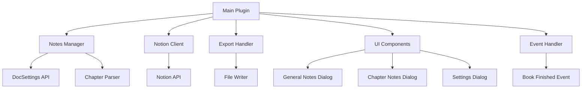

# KOReader Notes Plugin Implementation Plan

## Overview

Create a new KOReader plugin `notes_sync.koplugin` that allows users to manage reading notes, export them, and sync to Notion. The plugin will depend on `hardcoverapp.koplugin` for UI components and use KOReader's DocSettings API for storing notes.

## Architecture



## File Structure

```
notes_sync.koplugin/
├── _meta.lua                    # Plugin metadata
├── main.lua                      # Main plugin entry point
├── lib/
│   ├── notes_manager.lua         # Core notes management (read/write from DocSettings)
│   ├── chapter_parser.lua        # Extract chapter info from document TOC
│   ├── export_handler.lua        # Export notes to file in specified format
│   ├── notion_client.lua         # Notion API integration
│   ├── config.lua                # Settings management
│   └── events.lua                 # Event handling (book finished)
└── ui/
    ├── notes_menu.lua            # Main menu UI
    ├── notes_viewer_dialog.lua   # General & Chapter notes editor with highlights
    └── settings_dialog.lua       # Settings UI
```

## Implementation Details

### 1. Plugin Structure (`_meta.lua`, `main.lua`)

- Follow KOReader plugin conventions (similar to `metadata_sync.koplugin`)
- Extend `WidgetContainer` for UI integration
- Register with main menu
- Check for `hardcoverapp.koplugin` dependency

### 2. Notes Manager (`lib/notes_manager.lua`)

- Use `DocSettings:open(file_path)` to access book-specific settings
- Store general notes in `doc_settings:readSetting("general_notes")`
- Store chapter notes as `doc_settings:readSetting("chapter_notes")` (table indexed by chapter number)
- Access highlights via `ui.highlight:getBookHighlights()` or from DocSettings
- Map highlights to chapters based on page numbers

### 3. Chapter Parser (`lib/chapter_parser.lua`)

- Access document TOC via `document:getTOC()` or `document:tocItems()`
- Map page numbers to chapter numbers
- Provide chapter lookup by page number

### 4. Export Handler (`lib/export_handler.lua`)

- Format notes according to specification:
  - `=== General Notes ===` section
  - `=== Chapter N .... ===` sections with highlights and notes
  - Format: `[page a-b]```highlight```[my note]`
- Write to user-specified file location
- Handle file I/O with proper error handling

### 5. Notion Client (`lib/notion_client.lua`)

- Implement Notion API v1 integration
- Create/update pages in Notion database
- Use Notion API token from settings
- Format notes as Notion blocks (paragraphs, code blocks, callouts)
- Handle API errors and rate limiting

### 6. UI Components

#### Main Menu (`ui/notes_menu.lua`)

- [Sync] - Send notes to Notion
- [Export] - Export to local file
- [Open notes] - Submenu:
  - [General notes] - Open general notes editor
  - [Chapter N notes] - Open chapter notes editor for each chapter
- [Settings] - Configure Notion API token, auto-sync

#### General Notes Dialog (`ui/notes_viewer_dialog.lua`)

- Multi-line text editor (similar to `JournalDialog` in hardcoverapp)
- Load/save from DocSettings
- Use `TextBoxWidget` or `InputDialog` with `allow_newline = true`

#### Chapter Notes Dialog (`ui/notes_viewer_dialog.lua`)

- Display chapter title
- Show highlights for that chapter with page ranges
- Allow editing notes for each highlight
- Allow adding general chapter notes
- Save to DocSettings

### 7. Settings (`lib/config.lua`)

- Notion API token
- Notion database/page ID
- Auto-sync on book finish (toggle)
- Export file path (default location)
- Use `G_reader_settings:open("notes_sync")` for persistence

### 8. Event Handling (`lib/events.lua`)

- Listen to `onEndOfBook` event (similar to hardcoverapp)
- Check if auto-sync is enabled
- Trigger sync to Notion when book is finished

## Key Implementation Notes

1. **DocSettings Structure**:
   ```lua
   doc_settings:saveSetting("general_notes", text)
   doc_settings:saveSetting("chapter_notes", {
       [1] = { notes = "...", highlights = {...} },
       [2] = { notes = "...", highlights = {...} }
   })
   ```

2. **Highlight Access**:

   - Use `ui.highlight:getBookHighlights()` to get all highlights
   - Filter by page range to match to chapters
   - Store highlight text and associated notes

3. **Chapter Mapping**:

   - Get TOC from document
   - Map page numbers to chapter indices
   - Handle books without TOC gracefully

4. **Notion Integration**:

   - Use Notion API to create/update pages
   - Format as structured blocks
   - Handle authentication via API token

5. **Export Format**:

   - Strict adherence to specified format
   - Handle edge cases (no notes, no highlights, missing chapters)

## Dependencies

- `hardcoverapp.koplugin` - For UI components (JournalDialog pattern)
- KOReader core APIs: `DocSettings`, `UIManager`, `WidgetContainer`
- Notion API (HTTP client via `socket.http`)

## Testing Considerations

- Test with books that have/don't have TOC
- Test with no highlights/notes
- Test Notion API connectivity
- Test export file writing
- Test event handling on book finish